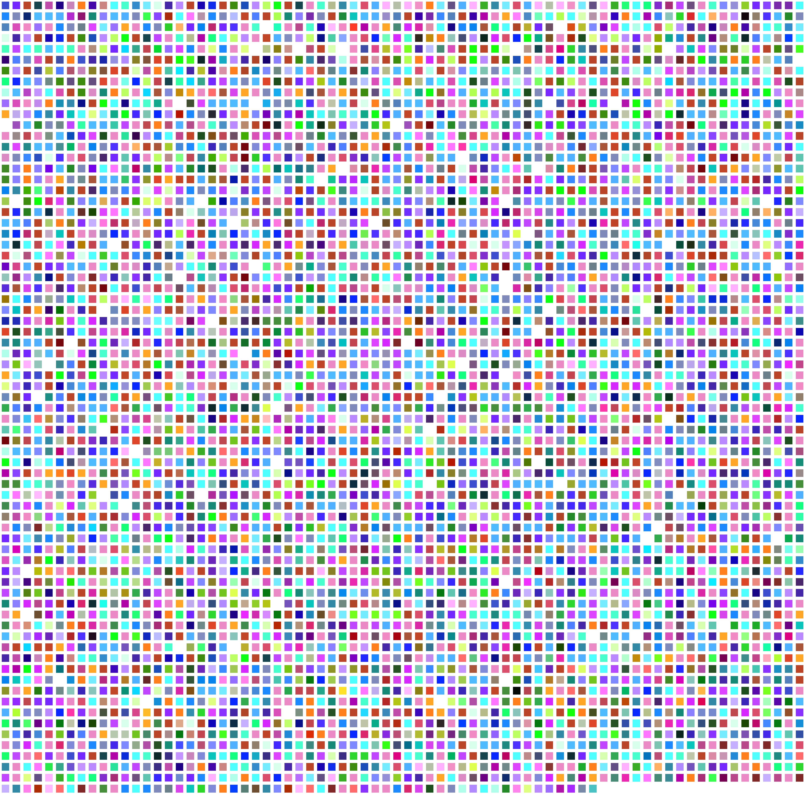

# Squares
_What do words look like as numbers? This mini project renders text as colors using python and saves them in a grid as a screenshot._



## How?
Given a word, eg 'Abcd' each letter of the word is assigned a value to where it sits in the alphabet. A = 0, b = 1, etc. As RGB values only need 3 numbers, we use the remaining letters to tweek the initial values from the first three...
 - Word is 'Abcd'
 - Values are `[0,1,2]` 
 - Remaining values are `[3]`
 - Add `[3]` to value 1.
### What happens with large words?
Large words will still slightly affect the 3 color values using a zip cycle. EG:
 - Word is 'Abcdefghij' 
 - Values are `[0,1,2]`
 - Remaining values are `[3,4,5,6,7,8,9]`
 - For each of the remaining values, go through the initial values and add them so,
   - Remaining value 3 is added to val[0]
   - Remaining value 4 is added to val[1]
   - Remaining value 5 is added to val[2]
   - Remaining value 6 is added to val[0]
   - Remaining value 7 is added to val[1] 
    ```
    for i, j in zip(cycle(range(len(colors))), additions):
      colors[i] += j
      colors[i] = int(colors[i])
    ```
    - Values are also multiplied respective of the upper rgb limit of 255 not being breached.

## Why?
I've being trying to learn more python so this was engaging enough to stick with. (Not sure what the standard of my code is like!)

## Who?
Setting the placement of the plots involved tricky math, thanks to Ashley Burdett for helping.
 
